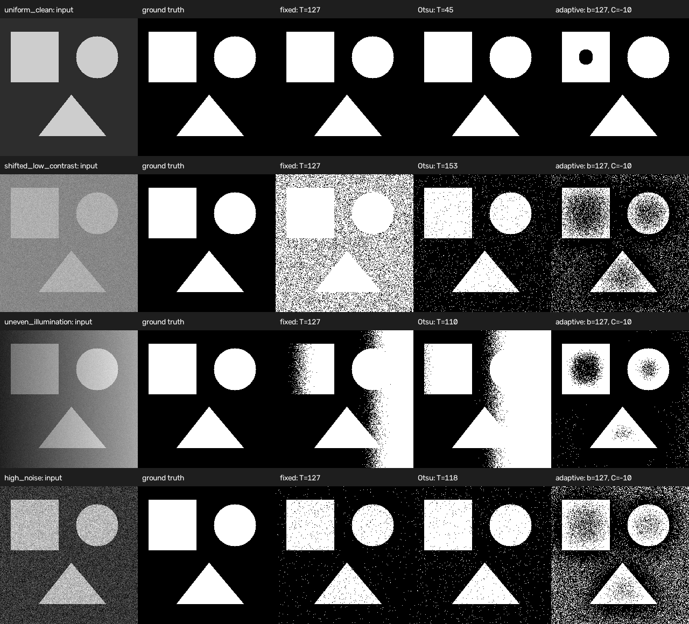
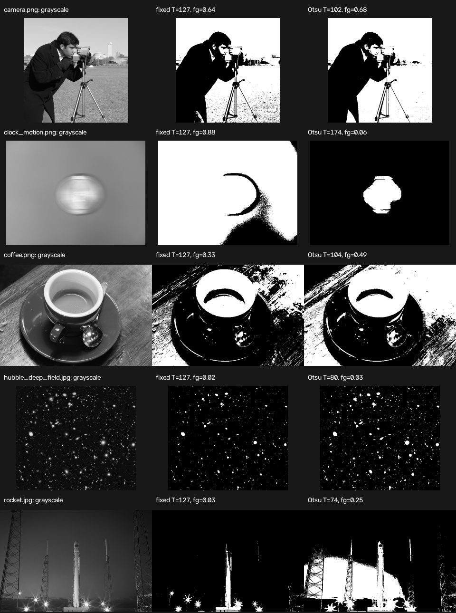

# Vision Playground

[](https://github.com/cab0a/vision-playground/actions/workflows/ci.yml)

## Overview

Vision Playground contains small, reproducible computer vision experiments organized around a research question, an implementation, and a quantitative evaluation.

The first experiment compares a fixed global threshold with Otsu's method on deterministic synthetic images. Synthetic inputs keep the experiment public, reproducible, and independent of private datasets.

## Research Question

How does automatic global threshold selection compare with a fixed threshold when foreground contrast, noise, and illumination change?

## Hypothesis

A fixed threshold should work well when foreground and background intensities are stable. Otsu's method should be more robust when the intensity distribution shifts, but both global methods should degrade when foreground and background values overlap under uneven illumination.

## Methods

The experiment compares two OpenCV implementations:

- **Fixed threshold:** `cv2.threshold` with a threshold of `127`
- **Otsu threshold:** `cv2.threshold` with `cv2.THRESH_OTSU`

Otsu's method selects a single threshold from the image histogram. It removes the need to choose the value manually, but it remains a global method.

## Synthetic Dataset

The generator creates one binary ground-truth mask containing multiple geometric shapes and renders four grayscale scenarios:

- `uniform_clean`: clearly separated foreground and background intensities
- `shifted_low_contrast`: a smaller intensity gap shifted above the fixed threshold
- `uneven_illumination`: a horizontal illumination gradient that causes class overlap
- `high_noise`: clearly separated classes with strong Gaussian noise

The random generator uses a fixed seed. No downloaded, private, or manually collected images are required.

## Evaluation

Each predicted binary mask is compared with the known ground truth using:

- Intersection over Union (IoU)
- Precision
- Recall
- F1 score

The experiment records the threshold selected by each method and writes all metrics to CSV.

## Results

The reference run uses seed `7` and a fixed threshold of `127`.

| Scenario | Method | Threshold | IoU | F1 |
| --- | --- | ---: | ---: | ---: |
| `uniform_clean` | Fixed | 127 | 1.000 | 1.000 |
| `uniform_clean` | Otsu | 45 | 1.000 | 1.000 |
| `shifted_low_contrast` | Fixed | 127 | 0.333 | 0.499 |
| `shifted_low_contrast` | Otsu | 153 | 0.914 | 0.955 |
| `uneven_illumination` | Fixed | 127 | 0.453 | 0.623 |
| `uneven_illumination` | Otsu | 110 | 0.453 | 0.623 |
| `high_noise` | Fixed | 127 | 0.953 | 0.976 |
| `high_noise` | Otsu | 118 | 0.945 | 0.972 |

Otsu's method adapts successfully when the low-contrast distribution shifts above the fixed threshold. Both methods perform poorly under uneven illumination because a single global threshold cannot separate overlapping foreground and background intensities. The fixed threshold is slightly better in the generated high-noise case, which shows that automatic selection is not universally superior.



Reproduce the reference artifacts with:

```bash
python experiments/run_thresholding_comparison.py --output results
```

The generated comparison image and metrics table are committed with the repository so the evaluated outputs are visible without running the code.

## Public Image Sample

The same two methods are also applied to five CC0 or public-domain photographs from the scikit-image sample data.

```bash
python experiments/run_public_image_sample.py
```


These photographs do not include semantic ground-truth masks, so the example reports the selected threshold and foreground fraction without claiming segmentation accuracy. It is a qualitative check of how the methods behave on varied scenes. See the [public sample analysis and attribution](results/public_sample/README.md) for the detailed interpretation and licenses.

## Inspected Research Workflow

An optional workflow connects [Image Dataset Inspector](https://github.com/cab0a/image-dataset-inspector) to the public-image experiment:

`Input Inspection → Thresholding Prototype → Qualitative Evaluation → Interpretation`

```bash
python -m pip install ".[workflow]"
python experiments/run_inspected_public_sample.py
```

The input audit records unreadable files and descriptive image metrics before any thresholding is performed. Only valid images continue to the experiment. A combined CSV then joins the inspection metrics with the fixed and Otsu outputs for traceable analysis.



See the [workflow results and interpretation](results/inspected_public_sample/README.md) for the combined table, limitations, reproduction details, and data provenance.

## Quick Start

Python 3.10 or later is required.

On Debian or Ubuntu, install the distribution-provided `python3-venv` package if `venv` reports that `ensurepip` is unavailable.

```bash
python3 -m venv .venv
source .venv/bin/activate
python -m pip install --upgrade pip
python -m pip install ".[dev]"
python experiments/run_thresholding_comparison.py --output results
python -m pytest
```

Expected experiment summary:

```text
Scenarios: 4
Evaluations: 8
Metrics: results/thresholding_metrics.csv
Comparison: results/thresholding_comparison.png
```

## Output

The experiment writes:

- `results/thresholding_metrics.csv`: thresholds and evaluation metrics
- `results/thresholding_comparison.png`: input, ground truth, and predicted masks
- `results/inspected_public_sample/input_inspection.csv`: input audit from Image Dataset Inspector
- `results/inspected_public_sample/workflow_summary.csv`: joined inspection and thresholding diagnostics

## Project Structure

```text
vision-playground/
├── .github/
│   └── workflows/
│       └── ci.yml
├── experiments/
│   ├── run_inspected_public_sample.py
│   ├── run_public_image_sample.py
│   └── run_thresholding_comparison.py
├── results/
│   ├── inspected_public_sample/
│   │   ├── README.md
│   │   ├── input_inspection.csv
│   │   ├── thresholding_comparison.jpg
│   │   ├── thresholding_summary.csv
│   │   └── workflow_summary.csv
│   ├── public_sample/
│   │   ├── README.md
│   │   ├── thresholding_comparison.jpg
│   │   └── thresholding_summary.csv
│   ├── thresholding_comparison.png
│   └── thresholding_metrics.csv
├── src/
│   └── vision_playground/
│       ├── __init__.py
│       ├── evaluation.py
│       ├── experiment.py
│       ├── real_images.py
│       ├── synthetic.py
│       ├── thresholding.py
│       └── workflow.py
├── tests/
│   ├── test_evaluation.py
│   ├── test_experiment.py
│   ├── test_real_images.py
│   ├── test_synthetic.py
│   ├── test_thresholding.py
│   └── test_workflow.py
├── .gitignore
├── LICENSE
├── README.md
└── pyproject.toml
```

## Limitations

- The scenarios are synthetic and do not represent the full variation of real images.
- IoU and F1 measure agreement with the generated masks, not downstream task performance.
- Both compared methods use one global threshold and are expected to struggle under spatially varying illumination.
- The selected fixed threshold is intentionally not tuned per scenario.
- Conclusions are limited to the generated conditions and should be validated on task-specific public data before practical use.
- The inspected workflow requires unique basenames for valid input images when results are joined.

## Roadmap

Possible later experiments include adaptive thresholding under uneven illumination, denoising comparisons with a clean reference, and edge detection under controlled noise. They remain separate experiments so each research question can be evaluated independently.

## References

- [OpenCV: Image Thresholding](https://docs.opencv.org/4.x/d7/d4d/tutorial_py_thresholding.html)
- Nobuyuki Otsu, [A Threshold Selection Method from Gray-Level Histograms](https://doi.org/10.1109/TSMC.1979.4310076), 1979

## License

This project is licensed under the MIT License. See [LICENSE](LICENSE) for details.
