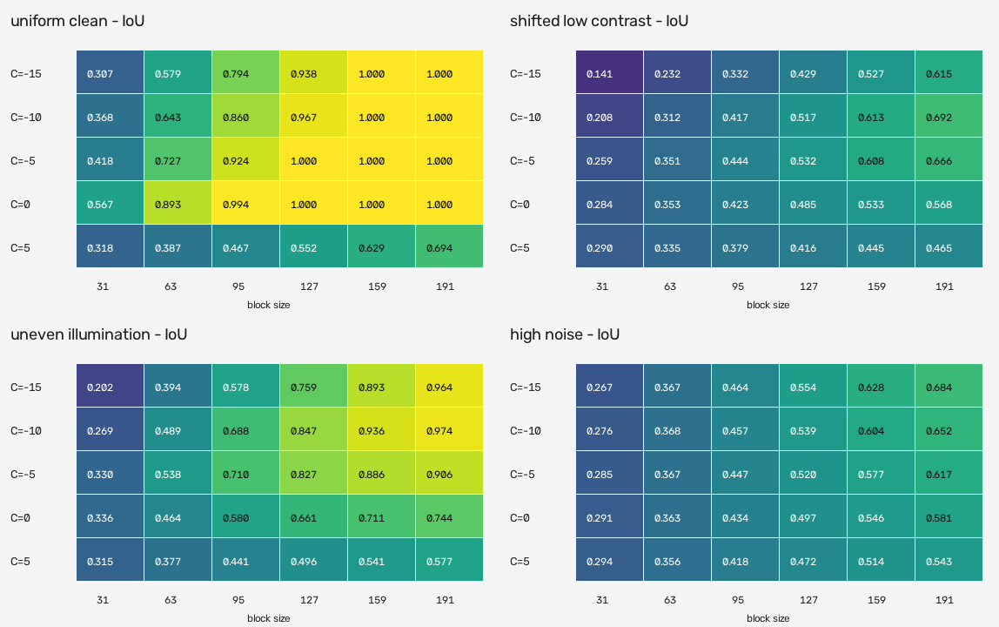
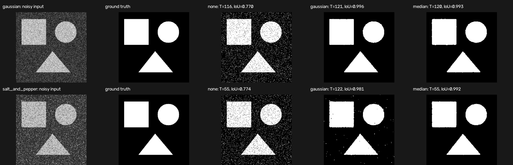
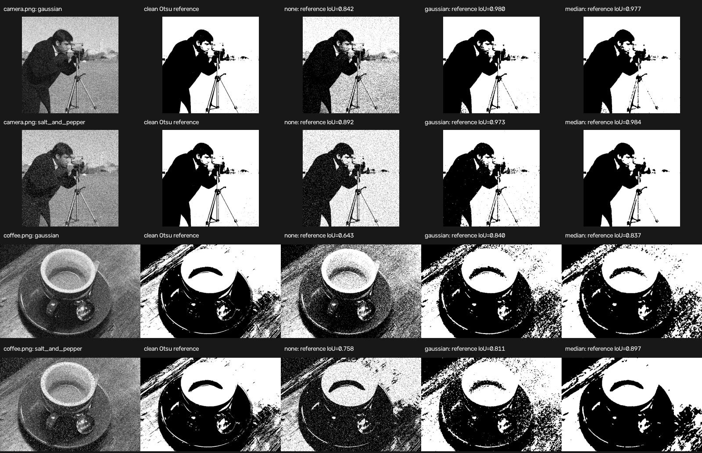
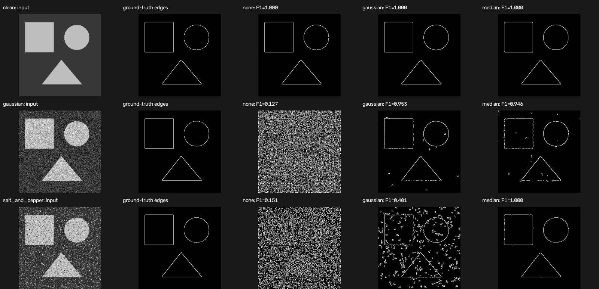
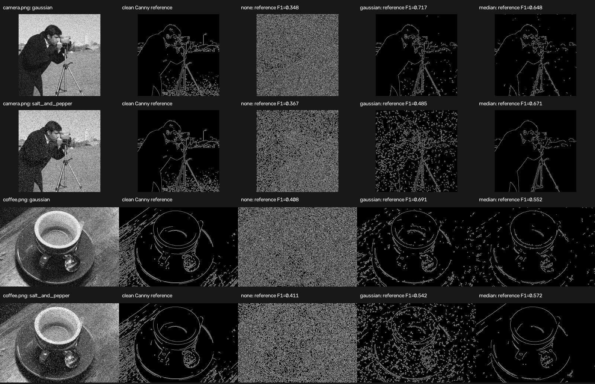
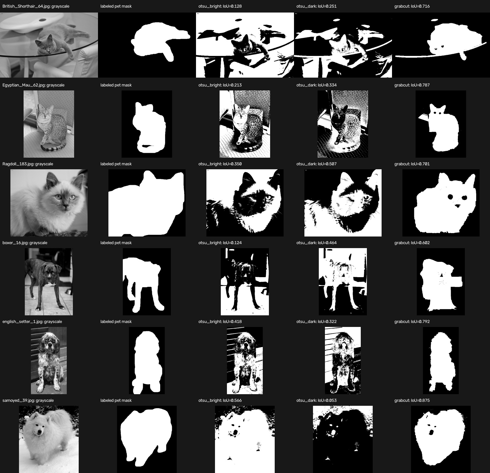

# Vision Playground

[](https://github.com/cab0a/vision-playground/actions/workflows/ci.yml)

## What This Project Demonstrates

- Image processing with OpenCV
- Reproducible experiment design
- Quantitative comparison using IoU, precision, recall, and F1
- Installable Python package and command-line interface
- Automated tests with pytest and CI with GitHub Actions
- Machine-readable CSV results and visual comparison artifacts
- Documentation of results, assumptions, and limitations


## Overview

Vision Playground contains small, reproducible computer vision experiments organized around a research question, an implementation, and an evaluation.

The thresholding study compares a fixed global threshold, Otsu's global method, and Gaussian adaptive thresholding on deterministic synthetic images. Parameter sensitivity, denoising, and Canny edge detection experiments evaluate behavior under controlled conditions. Freely reusable photographs provide separate qualitative and stability checks, while a labeled Oxford-IIIT Pet subset supports pixel-level quantitative evaluation. A unified CLI makes the core experiments discoverable and reproducible through one interface.

Version 1.0 is the stable baseline for the documented command-line interface, Python runner API, experiment identifiers, and reproducibility manifest schema.

## Engineering Approach

`Research → Prototype → Evaluation → Interpretation`

Each experiment starts with a narrow question, changes a controlled factor, records machine-readable metrics, and documents both the result and its limits. The focus is method selection and evidence, not a collection of disconnected demos.

| Capability | Reviewable evidence |
| --- | --- |
| Technical research | Questions, hypotheses, references, and parameter studies |
| Python and OpenCV implementation | Installable package, CLI, deterministic generators, and experiment modules |
| Quantitative evaluation | Synthetic ground truth, public pixel labels, CSV metrics, and visual comparisons |
| Failure analysis | Scenario-specific interpretation and explicit limitations |
| Reproducibility | 165 core evaluations, SHA-256 result verification, tests, and Python 3.10–3.14 CI |

For a short evidence-led tour, see the [review guide](docs/review-guide.md).

## Research Question

How do fixed, histogram-based, and locally adaptive thresholds behave when foreground contrast, noise, illumination, and adaptive parameters change?

Can simple preprocessing make Otsu thresholding more stable under Gaussian and salt-and-pepper noise, and does filter choice matter?

How does controlled noise affect Canny edge detection, and how much can simple denoising recover?

How do intensity-only and color-and-location segmentation baselines compare when human-labeled public masks are available?

## Hypothesis

A fixed threshold should work well when foreground and background intensities are stable. Otsu's method should adapt when the global intensity distribution shifts. Adaptive thresholding should improve separation under uneven illumination, but its local estimates should remain sensitive to neighborhood scale, noise, and low contrast.

Gaussian and median filtering should both reduce thresholding errors under the tested noise. Gaussian filtering should be strongest for Gaussian noise, while median filtering should better suppress isolated salt-and-pepper pixels.

Canny should produce many false edges when noise is not removed. Noise-matched preprocessing should improve precision while retaining the main boundaries.

## Methods

The experiment compares three OpenCV implementations:

- **Fixed threshold:** `cv2.threshold` with a threshold of `127`
- **Otsu threshold:** `cv2.threshold` with `cv2.THRESH_OTSU`
- **Adaptive threshold:** `cv2.adaptiveThreshold` with a Gaussian-weighted neighborhood, block size `127`, and `C = -10`

Otsu's method selects a single threshold from the image histogram. It removes the need to choose the value manually, but it remains a global method.

The adaptive method calculates a separate threshold for each pixel from its neighborhood. The reference block size is intentionally larger than the main foreground structures in the 256 × 256 synthetic images. A negative `C` raises the local threshold by 10 intensity levels because OpenCV subtracts `C` from the weighted neighborhood value. This is one geometry-aware experimental configuration, not a universal default.

The sensitivity analysis evaluates 30 adaptive configurations: block sizes `31`, `63`, `95`, `127`, `159`, and `191`, crossed with `C` values `-15`, `-10`, `-5`, `0`, and `5`. The same deterministic scenarios and pixel-level metrics are used for every configuration.

The denoising experiment fixes the downstream method to Otsu thresholding and changes only the preprocessing step: no filter, a 5 × 5 Gaussian filter, or a 5 × 5 median filter. It evaluates zero-mean Gaussian noise with standard deviation `45` and salt-and-pepper noise affecting `15%` of pixels.

The edge experiment applies Canny with thresholds `125` and `250` after the same preprocessing options. Predicted boundaries are evaluated with a two-pixel positional tolerance so minor rasterization shifts do not dominate the result.

The labeled public-data experiment evaluates brighter-foreground Otsu, darker-foreground Otsu, and fixed-inset GrabCut masks against Oxford-IIIT Pet trimaps. The labels are used only for evaluation, not during prediction.

## Synthetic Dataset

The generator creates one binary ground-truth mask containing multiple geometric shapes and renders four grayscale scenarios:

- `uniform_clean`: clearly separated foreground and background intensities
- `shifted_low_contrast`: a smaller intensity gap shifted above the fixed threshold
- `uneven_illumination`: a horizontal illumination gradient that causes class overlap
- `high_noise`: clearly separated classes with strong Gaussian noise

The random generator uses a fixed seed. No downloaded, private, or manually collected images are required.

## Evaluation

Each predicted binary mask is compared with the known ground truth using:

- Intersection over Union (IoU)
- Precision
- Recall
- F1 score

The experiment records the global threshold or adaptive parameters used by each method and writes all metrics to CSV.

## Results

The reference run uses seed `7`, a fixed threshold of `127`, and one adaptive configuration shared across all scenarios.

| Scenario | Method | Parameters | IoU | F1 |
| --- | --- | --- | ---: | ---: |
| `uniform_clean` | Fixed | `T = 127` | 1.000 | 1.000 |
| `uniform_clean` | Otsu | `T = 45` | 1.000 | 1.000 |
| `uniform_clean` | Adaptive | `block = 127, C = -10` | 0.967 | 0.983 |
| `shifted_low_contrast` | Fixed | `T = 127` | 0.333 | 0.499 |
| `shifted_low_contrast` | Otsu | `T = 153` | 0.914 | 0.955 |
| `shifted_low_contrast` | Adaptive | `block = 127, C = -10` | 0.517 | 0.682 |
| `uneven_illumination` | Fixed | `T = 127` | 0.453 | 0.623 |
| `uneven_illumination` | Otsu | `T = 110` | 0.453 | 0.623 |
| `uneven_illumination` | Adaptive | `block = 127, C = -10` | 0.847 | 0.917 |
| `high_noise` | Fixed | `T = 127` | 0.953 | 0.976 |
| `high_noise` | Otsu | `T = 118` | 0.945 | 0.972 |
| `high_noise` | Adaptive | `block = 127, C = -10` | 0.539 | 0.701 |

Otsu's method adapts successfully when the low-contrast distribution shifts above the fixed threshold. Under uneven illumination, both global methods remain near `0.453` IoU, while the adaptive method reaches `0.847` by using spatially varying thresholds.

The adaptive method is not uniformly better. It introduces small false-negative regions in the clean case, performs substantially below Otsu's method in the low-contrast case, and amplifies local noise in the high-noise case. The results support method selection based on failure conditions rather than treating any automatic method as a default improvement.

Reproduce the reference artifacts with:

```bash
python experiments/run_thresholding_comparison.py --output results
```

Use `--adaptive-block-size` and `--adaptive-c` to run an alternative shared adaptive configuration. The block size must be an odd integer of at least `3`.

The generated comparison image and metrics table are committed with the repository so the evaluated outputs are visible without running the code.

## Adaptive Parameter Sensitivity

The parameter grid produces 120 evaluations and an IoU heatmap:

```bash
python experiments/run_adaptive_sensitivity.py --output results
```

| Scenario | Best tested block size | Best tested C | IoU | F1 |
| --- | ---: | ---: | ---: | ---: |
| `uniform_clean` | 127 | -5 | 1.000 | 1.000 |
| `shifted_low_contrast` | 191 | -10 | 0.692 | 0.818 |
| `uneven_illumination` | 191 | -10 | 0.974 | 0.987 |
| `high_noise` | 191 | -15 | 0.684 | 0.812 |



Larger neighborhoods improve the tested uneven-illumination condition because they capture background variation across a wider spatial scale. They also improve the low-contrast and high-noise cases within this grid, but the best `C` differs by condition. The highest mean IoU across all four scenarios is `0.830` at `block = 191, C = -10`; this aggregate does not make the configuration optimal for every scenario.

The full [sensitivity metrics](results/adaptive_sensitivity_metrics.csv) preserve every evaluated configuration. The result demonstrates why adaptive parameters should be selected against representative conditions rather than copied as universal defaults.

## Public Image Sample

The two global methods are also applied to five CC0 or public-domain photographs from the scikit-image sample data.

```bash
python experiments/run_public_image_sample.py
```


These photographs do not include semantic ground-truth masks, so the example reports the selected threshold and foreground fraction without claiming segmentation accuracy. It is a qualitative check of how the methods behave on varied scenes. See the [public sample analysis and attribution](results/public_sample/README.md) for the detailed interpretation and licenses.

## Adaptive Public Image Sample

The same public photographs provide a qualitative one-factor-at-a-time comparison of adaptive block size and `C`:

```bash
python experiments/run_adaptive_public_sample.py
```


At `C = -10`, increasing the block size from `31` to `191` increases the foreground fraction in all five samples. Changing `C` from `-10` to `5` at block size `127` produces a larger shift, including `4.57%` to `91.60%` on the smooth clock image. These are behavioral diagnostics, not accuracy results.

See the [adaptive public sample analysis](results/adaptive_public_sample/README.md) for the configurations, quantitative summary, interpretation, and data provenance.

## Denoising Before Thresholding

The controlled denoising experiment uses the same known geometric ground truth for two noise models:

```bash
python experiments/run_denoising_comparison.py --output results
```

| Noise | Denoising | Otsu threshold | IoU | F1 |
| --- | --- | ---: | ---: | ---: |
| Gaussian | None | 116 | 0.770 | 0.870 |
| Gaussian | Gaussian 5 × 5 | 121 | 0.996 | 0.998 |
| Gaussian | Median 5 × 5 | 120 | 0.993 | 0.996 |
| Salt and pepper | None | 55 | 0.774 | 0.873 |
| Salt and pepper | Gaussian 5 × 5 | 122 | 0.981 | 0.990 |
| Salt and pepper | Median 5 × 5 | 55 | 0.992 | 0.996 |



Both filters substantially reduce pixel-level thresholding errors in these conditions. Gaussian filtering is best for the Gaussian-noise scenario, while median filtering is best for salt-and-pepper noise. The experiment isolates preprocessing choice by keeping the kernel size, clean intensity levels, ground truth, and downstream thresholding method fixed.

The full [denoising metrics](results/denoising_metrics.csv) include precision and recall as well as IoU and F1.

## Denoising Public Image Sample

Two public photographs are corrupted with the same known noise models:

```bash
python experiments/run_denoising_public_sample.py
```



The output after each denoising method is compared with the clean-image Otsu mask. This reference-mask IoU measures threshold stability, not semantic segmentation accuracy. See the [public denoising analysis](results/denoising_public_sample/README.md) for the results, interpretation, limitations, and data provenance.

## Edge Detection Under Controlled Noise

The Canny experiment evaluates clean, Gaussian-noise, and salt-and-pepper conditions:

```bash
python experiments/run_edge_detection_comparison.py --output results
```

| Condition | Denoising | Edge pixels | Precision | Recall | F1 |
| --- | --- | ---: | ---: | ---: | ---: |
| Clean | None | 987 | 1.000 | 1.000 | 1.000 |
| Gaussian noise | None | 23,565 | 0.068 | 1.000 | 0.127 |
| Gaussian noise | Gaussian 5 × 5 | 1,171 | 0.910 | 1.000 | 0.953 |
| Gaussian noise | Median 5 × 5 | 1,224 | 0.897 | 1.000 | 0.946 |
| Salt and pepper | None | 19,492 | 0.081 | 1.000 | 0.151 |
| Salt and pepper | Gaussian 5 × 5 | 4,659 | 0.251 | 1.000 | 0.401 |
| Salt and pepper | Median 5 × 5 | 985 | 1.000 | 1.000 | 1.000 |



The unfiltered noisy images preserve the true boundary neighborhoods but create many false edges, producing high recall and very low precision. Gaussian filtering recovers the Gaussian-noise condition, while median filtering removes the isolated salt-and-pepper responses in this synthetic case.

The [edge metrics CSV](results/edge_detection_metrics.csv) includes all nine evaluations, thresholds, tolerance, edge counts, precision, recall, and F1.

## Edge Detection Public Image Sample

The same controlled noise and preprocessing choices are applied to the camera and coffee photographs:

```bash
python experiments/run_edge_public_sample.py
```



The public sample compares each noisy output with the clean-image Canny edge map. It measures algorithmic stability rather than agreement with human-labeled boundaries. See the [public edge analysis](results/edge_public_sample/README.md) for results, metric details, limitations, and provenance.

## Labeled Public Dataset Evaluation

A six-image Oxford-IIIT Pet subset provides pixel-level trimaps for a compact quantitative comparison:

```bash
python experiments/run_labeled_dataset_evaluation.py
```

| Method | Mean IoU | Mean F1 |
| --- | ---: | ---: |
| Brighter-foreground Otsu | 0.300 | 0.438 |
| Darker-foreground Otsu | 0.322 | 0.466 |
| Fixed-inset GrabCut | 0.745 | 0.851 |



The two Otsu polarities vary sharply by image because the pet is not consistently brighter or darker than its background. GrabCut performs better on all six selected images by combining color distributions with the assumption that the image boundary contains background. The small, fixed subset is useful for a reviewable experiment, but it is not a representative benchmark of the full dataset.

See the [labeled evaluation report](results/labeled_public_dataset/README.md) for per-image interpretation, reproduction details, data provenance, and limitations.

## Unified Experiment Interface

The installed command exposes stable identifiers for the five core quantitative experiments:

```bash
vision-playground list
vision-playground run thresholding
vision-playground run adaptive-sensitivity
vision-playground run denoising
vision-playground run edge-detection
vision-playground run labeled-dataset
```

Run every default configuration and create a cross-experiment index with:

```bash
vision-playground run all
```

Expected summary:

```text
Completed experiments: 5
Evaluations: 165
Summary: results/experiment_summary.csv
```

| Experiment | Evaluations | Metric | Reference value | Evidence scope |
| --- | ---: | --- | ---: | --- |
| `thresholding` | 12 | IoU | 0.847 | Adaptive method under uneven illumination |
| `adaptive-sensitivity` | 120 | Mean IoU | 0.830 | Best tested shared configuration |
| `denoising` | 6 | IoU | 0.992 | Median filter under salt-and-pepper noise |
| `edge-detection` | 9 | F1 | 1.000 | Median filter under salt-and-pepper noise |
| `labeled-dataset` | 18 | Mean IoU | 0.745 | GrabCut on the selected six-image subset |

The values answer different research questions and are not directly comparable. The [experiment results index](results/README.md) defines the summary schema and links each value to detailed evidence.

## Reproducibility Verification

After running the core suite, verify the six deterministic numeric artifacts against the committed SHA-256 manifest:

```bash
vision-playground run all
vision-playground verify
```

Expected verification:

```text
Verified files: 6
Manifest: results/reproducibility_manifest.csv
```

The strict check covers metrics and the cross-experiment summary. Comparison images remain reviewable artifacts but are excluded from byte-level verification because image encoding can vary across OpenCV builds.

See the [reproducibility guide](docs/reproducibility.md) for deterministic controls, dependency boundaries, data provenance, and the reviewed process for updating reference results.

## Documentation

- [Review guide](docs/review-guide.md): a short evidence-led path through the repository
- [Experiment design](docs/experiment-design.md): questions, controls, evidence types, and criteria for adding a study
- [Result interpretation](docs/result-interpretation.md): metric definitions, valid comparisons, and claim boundaries
- [Public API](docs/public-api.md): supported CLI commands, Python functions, errors, and compatibility scope
- [Reproducibility](docs/reproducibility.md): environment, deterministic controls, checksums, and data provenance
- [Changelog](CHANGELOG.md): version-by-version project evolution

## Inspected Research Workflow

An optional workflow connects [Image Dataset Inspector](https://github.com/cab0a/image-dataset-inspector) to the public-image experiment:

`Input Inspection → Thresholding Prototype → Qualitative Evaluation → Interpretation`

```bash
python -m pip install ".[workflow]"
python experiments/run_inspected_public_sample.py
```

The input audit records unreadable files and descriptive image metrics before any thresholding is performed. Only valid images continue to the experiment. A combined CSV then joins the inspection metrics with the fixed and Otsu outputs for traceable analysis.


See the [workflow results and interpretation](results/inspected_public_sample/README.md) for the combined table, limitations, reproduction details, and data provenance.

## Quick Start

Python 3.10 or later is required.

On Debian or Ubuntu, install the distribution-provided `python3-venv` package if `venv` reports that `ensurepip` is unavailable.

```bash
python3 -m venv .venv
source .venv/bin/activate
python -m pip install --upgrade pip
python -m pip install ".[dev]"
vision-playground --version
vision-playground list
vision-playground run all
vision-playground verify
python -m pytest
```

Expected experiment summary:

```text
Completed experiments: 5
Evaluations: 165
Summary: results/experiment_summary.csv
```

The public-image commands download checksum-verified, freely reusable samples and require network access on their first run.

## Output

The experiment writes:

- `results/experiment_summary.csv`: evidence-oriented index of all five core experiments
- `results/reproducibility_manifest.csv`: SHA-256 identities for deterministic numeric artifacts
- `results/thresholding_metrics.csv`: global thresholds, adaptive parameters, and evaluation metrics
- `results/thresholding_comparison.png`: input, ground truth, and predicted masks
- `results/adaptive_sensitivity_metrics.csv`: all adaptive parameter-grid evaluations
- `results/adaptive_sensitivity_heatmap.png`: scenario-level IoU sensitivity
- `results/adaptive_public_sample/adaptive_parameter_summary.csv`: public-image foreground fractions
- `results/adaptive_public_sample/adaptive_parameter_comparison.jpg`: qualitative adaptive outputs
- `results/denoising_metrics.csv`: denoising and Otsu metrics for controlled noise
- `results/denoising_comparison.png`: synthetic denoising outputs
- `results/denoising_public_sample/denoising_summary.csv`: public-image stability metrics
- `results/denoising_public_sample/denoising_comparison.jpg`: public-image denoising outputs
- `results/edge_detection_metrics.csv`: controlled Canny boundary metrics
- `results/edge_detection_comparison.png`: synthetic edge detection outputs
- `results/edge_public_sample/edge_detection_summary.csv`: public-image edge stability metrics
- `results/edge_public_sample/edge_detection_comparison.jpg`: public-image edge outputs
- `results/labeled_public_dataset/labeled_dataset_metrics.csv`: per-image metrics against Oxford-IIIT Pet trimaps
- `results/labeled_public_dataset/labeled_dataset_comparison.jpg`: images, labels, and predicted masks
- `results/inspected_public_sample/input_inspection.csv`: input audit from Image Dataset Inspector
- `results/inspected_public_sample/workflow_summary.csv`: joined inspection and thresholding diagnostics

## Project Structure

```text
vision-playground/
├── .github/
│   └── workflows/
│       └── ci.yml
├── data/
│   └── oxford_pet_sample/
│       ├── images/
│       ├── trimaps/
│       ├── README.md
│       └── manifest.csv
├── docs/
│   ├── experiment-design.md
│   ├── public-api.md
│   ├── reproducibility.md
│   ├── review-guide.md
│   └── result-interpretation.md
├── experiments/
│   ├── create_reproducibility_manifest.py
│   ├── run_adaptive_public_sample.py
│   ├── run_adaptive_sensitivity.py
│   ├── run_denoising_comparison.py
│   ├── run_denoising_public_sample.py
│   ├── run_edge_detection_comparison.py
│   ├── run_edge_public_sample.py
│   ├── run_inspected_public_sample.py
│   ├── run_labeled_dataset_evaluation.py
│   ├── run_public_image_sample.py
│   └── run_thresholding_comparison.py
├── results/
│   ├── README.md
│   ├── experiment_summary.csv
│   ├── reproducibility_manifest.csv
│   ├── adaptive_public_sample/
│   │   ├── README.md
│   │   ├── adaptive_parameter_comparison.jpg
│   │   └── adaptive_parameter_summary.csv
│   ├── denoising_public_sample/
│   │   ├── README.md
│   │   ├── denoising_comparison.jpg
│   │   └── denoising_summary.csv
│   ├── edge_public_sample/
│   │   ├── README.md
│   │   ├── edge_detection_comparison.jpg
│   │   └── edge_detection_summary.csv
│   ├── labeled_public_dataset/
│   │   ├── README.md
│   │   ├── labeled_dataset_comparison.jpg
│   │   └── labeled_dataset_metrics.csv
│   ├── inspected_public_sample/
│   │   ├── README.md
│   │   ├── input_inspection.csv
│   │   ├── thresholding_comparison.jpg
│   │   ├── thresholding_summary.csv
│   │   └── workflow_summary.csv
│   ├── public_sample/
│   │   ├── README.md
│   │   ├── thresholding_comparison.jpg
│   │   └── thresholding_summary.csv
│   ├── adaptive_sensitivity_heatmap.png
│   ├── adaptive_sensitivity_metrics.csv
│   ├── denoising_comparison.png
│   ├── denoising_metrics.csv
│   ├── edge_detection_comparison.png
│   ├── edge_detection_metrics.csv
│   ├── thresholding_comparison.png
│   └── thresholding_metrics.csv
├── src/
│   └── vision_playground/
│       ├── __init__.py
│       ├── adaptive_sample.py
│       ├── cli.py
│       ├── denoising.py
│       ├── denoising_sample.py
│       ├── edge_detection.py
│       ├── edge_sample.py
│       ├── evaluation.py
│       ├── experiment.py
│       ├── labeled_dataset.py
│       ├── real_images.py
│       ├── reproducibility.py
│       ├── runner.py
│       ├── sensitivity.py
│       ├── synthetic.py
│       ├── thresholding.py
│       └── workflow.py
├── tests/
│   ├── test_adaptive_sample.py
│   ├── test_cli.py
│   ├── test_denoising.py
│   ├── test_denoising_sample.py
│   ├── test_edge_detection.py
│   ├── test_edge_sample.py
│   ├── test_evaluation.py
│   ├── test_experiment.py
│   ├── test_labeled_dataset.py
│   ├── test_package.py
│   ├── test_real_images.py
│   ├── test_reproducibility.py
│   ├── test_runner.py
│   ├── test_sensitivity.py
│   ├── test_synthetic.py
│   ├── test_thresholding.py
│   └── test_workflow.py
├── .gitignore
├── CHANGELOG.md
├── LICENSE
├── README.md
└── pyproject.toml
```

## Limitations

- The scenarios are synthetic and do not represent the full variation of real images.
- IoU and F1 measure agreement with the generated masks, not downstream task performance.
- The fixed and Otsu methods use one global threshold and are expected to struggle under spatially varying illumination.
- The selected fixed threshold is intentionally not tuned per scenario.
- The reference comparison uses one adaptive configuration across scenarios; the separate sensitivity grid is finite and tuned to the scale of the synthetic generator.
- Adaptive thresholding can amplify local noise or remove foreground interiors when its neighborhood and offset do not match the image structure.
- Foreground fraction on the public photographs describes output behavior but is not a segmentation-quality metric.
- The denoising study uses two synthetic noise models, one severity per model, and one kernel size; it does not establish a universal filter choice.
- Public-image reference-mask IoU measures consistency with Otsu's clean-image output, not agreement with human labels.
- Edge reference F1 uses a dilation-based positional tolerance without one-to-one boundary matching.
- Public-image edge references are Canny outputs rather than human annotations.
- The labeled public evaluation uses six selected images and cannot support dataset-wide or breed-level claims.
- The fixed-inset GrabCut baseline assumes that the subject is separated from the image boundary.
- Dataset labels are used only for evaluation, but the chosen subset and metric policy still influence the reported result.
- Cross-experiment reference values have different targets and aggregation policies and must not be interpreted as a ranking.
- Conclusions are limited to the generated conditions and should be validated on task-specific public data before practical use.
- The inspected workflow requires unique basenames for valid input images when results are joined.

## Project Status

Version 1.0 is the stable public baseline. Backward compatibility for the documented CLI, runner API, reproducibility API, experiment identifiers, dataclasses, and manifest schema follows the policy in the [public API guide](docs/public-api.md).

Future work may expand labeled evaluation, add controlled studies for other computer vision tasks, or measure performance at larger input scales. Such work will remain separate, reproducible studies with explicit evidence boundaries.

## References

- [OpenCV: Image Thresholding](https://docs.opencv.org/4.x/d7/d4d/tutorial_py_thresholding.html)
- [OpenCV: Smoothing Images](https://docs.opencv.org/4.x/d4/d13/tutorial_py_filtering.html)
- [OpenCV: Canny Edge Detection](https://docs.opencv.org/4.x/da/d22/tutorial_py_canny.html)
- [Oxford-IIIT Pet Dataset](https://www.robots.ox.ac.uk/~vgg/data/pets/)
- Nobuyuki Otsu, [A Threshold Selection Method from Gray-Level Histograms](https://doi.org/10.1109/TSMC.1979.4310076), 1979
- Omkar M. Parkhi, Andrea Vedaldi, Andrew Zisserman, and C. V. Jawahar, [Cats and Dogs](https://www.robots.ox.ac.uk/~vgg/publications/2012/Parkhi12a/), 2012

## License

The project code is licensed under the MIT License. See [LICENSE](LICENSE) for details.

The committed Oxford-IIIT Pet subset and its derived visual artifacts retain the Creative Commons Attribution-ShareAlike 4.0 terms documented in the [dataset attribution](data/oxford_pet_sample/README.md).
