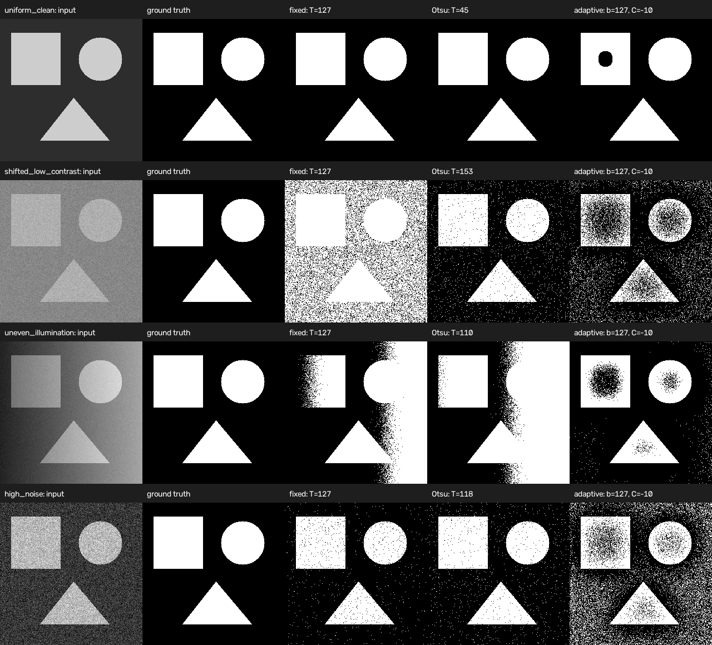

# Vision Playground

## 日本語概要

このリポジトリは、二値化、ノイズ除去、輪郭検出、古典的な画像分割を、正解データ付きの合成画像と公開画像で比較する、再現可能なコンピュータビジョン実験集です。

主な内容は次のとおりです。

- 5つの実験を共通のコマンドから実行可能
- 手法と条件の組み合わせによる合計165件の評価
- 正解データ付きの合成画像と、固定した6枚のラベル付き公開画像
- CSV形式の評価結果、比較図、SHA-256ハッシュで検証する6件の数値成果物
- 31件のテストをPython 3.10〜3.14で自動実行し、Python 3.12では再生成した数値結果と比較画像の差分を検査

結果の解釈、再現手順、制約の詳細は、以下の英語本文を参照してください。

---

Compare classical computer-vision methods under controlled conditions, then inspect their metrics, sensitivity, visual output, and failure cases.

## Overview

Vision Playground is a collection of small, reproducible computer-vision experiments. It compares methods rather than presenting one successful demo image.

The repository evaluates thresholding, adaptive-parameter sensitivity, denoising, Canny edge detection, and classical segmentation. Deterministic synthetic images isolate failure conditions. Freely reusable photographs provide qualitative and stability checks, while a fixed Oxford-IIIT Pet subset provides public pixel labels.

This repository compares algorithms. It does not replace `image-dataset-inspector`, which audits input files, or `research-notes`, which records sources and a longer sequence of research investigations.

Version 1.0 is the stable baseline for the documented CLI, Python runner API, experiment identifiers, dataclasses, and reproducibility manifest schema.

## Representative Result

The thresholding comparison shows why method choice depends on the image condition.



| Condition | Best result highlighted by the experiment | IoU |
| --- | --- | ---: |
| Uniform clean image | Fixed and Otsu both recover the mask | 1.000 |
| Shifted low contrast | Otsu adapts to the shifted histogram | 0.914 |
| Uneven illumination | Adaptive thresholding uses local context | 0.847 |
| High noise | Fixed threshold avoids the tested adaptive failure | 0.953 |

The same adaptive configuration that leads under uneven illumination reaches only `0.539` IoU under high noise. The complete thresholds, parameters, precision, recall, and F1 values are in [`thresholding_metrics.csv`](results/thresholding_metrics.csv).

## Key Features

- Five registered experiments with 165 method-condition evaluations
- Deterministic synthetic masks plus a fixed, labeled six-image public subset
- IoU, precision, recall, F1, threshold, and stability measurements written to CSV
- Public-image examples kept separate from accuracy claims when labels are unavailable
- Unified CLI, installable package, and documented Python runner API
- Six checksum-verified numeric artifacts and reviewable comparison figures
- 31 tests and GitHub Actions on Python 3.10 through 3.14
- Experiment-specific assumptions, failure analysis, and claim boundaries

## Evaluation Boundaries

- Synthetic results explain behavior under controlled conditions; they do not represent the full variation of real images.
- Unlabeled public samples measure output behavior or stability, not semantic accuracy.
- The labeled public study uses six selected images and is not a full-dataset benchmark.
- The adaptive parameter search is finite; its best tested configuration is not a universal optimum.
- Summary values use different targets and aggregation policies and must not be ranked across experiments.
- Version 1.0 stability applies to documented software interfaces, not model generalization or byte-identical image encoding.

See [Limitations](docs/limitations.md) for the experiment-specific boundaries.

## Quick Start

Python 3.10 or later is required. On Debian or Ubuntu, install `python3-venv` if `venv` reports that `ensurepip` is unavailable.

```bash
git clone https://github.com/cab0a/vision-playground.git
cd vision-playground
python3 -m venv .venv
source .venv/bin/activate
python -m pip install -e .
vision-playground run thresholding --output output/quickstart
```

Review:

- `output/quickstart/thresholding_comparison.png`
- `output/quickstart/thresholding_metrics.csv`

Run all five default experiments and create the evidence index with:

```bash
vision-playground run all --output output/all
```

The cross-experiment summary is written to `output/all/experiment_summary.csv`.

## Generated Artifacts

| Artifact group | Main outputs | Purpose |
| --- | --- | --- |
| Cross-experiment index | `experiment_summary.csv` | Locates one reviewable value from each core experiment |
| Reproducibility | `reproducibility_manifest.csv` | Stores SHA-256 identities for six deterministic numeric artifacts |
| Controlled studies | `*_metrics.csv`, `*_comparison.png` | Preserves parameters, metrics, inputs, labels, and predictions |
| Public samples | Subdirectories under `results/` | Stores qualitative figures and stability summaries with provenance |
| Inspected workflow | `input_inspection.csv`, `workflow_summary.csv` | Connects input audit evidence to thresholding outputs |

Reference artifacts are committed under [`results/`](results/README.md). The result index defines the summary schema and links to every detailed report.

## Core Experiments

| Identifier | Question | Evaluations | Main evidence |
| --- | --- | ---: | --- |
| `thresholding` | How do global and local thresholds fail as image conditions change? | 12 | Synthetic masks, pixel metrics, and a comparison figure |
| `adaptive-sensitivity` | How sensitive is adaptive thresholding to block size and `C`? | 120 | Full parameter grid and an IoU heatmap |
| `denoising` | Which preprocessing filter helps Otsu under two controlled noise models? | 6 | Segmentation metrics before and after filtering |
| `edge-detection` | How does noise affect Canny, and what does denoising recover? | 9 | Tolerance-aware edge metrics and edge counts |
| `labeled-dataset` | How do intensity-only baselines compare with fixed-inset GrabCut? | 18 | Metrics against public trimaps |

Discover and run them through the installed command:

```bash
vision-playground list
vision-playground run thresholding
vision-playground run adaptive-sensitivity
vision-playground run denoising
vision-playground run edge-detection
vision-playground run labeled-dataset
```

## Results

The default suite reports:

```text
Completed experiments: 5
Evaluations: 165
Summary: results/experiment_summary.csv
```

| Experiment | Evaluations | Metric | Reference value | Evidence scope |
| --- | ---: | --- | ---: | --- |
| `thresholding` | 12 | IoU | 0.847 | Adaptive method under uneven illumination |
| `adaptive-sensitivity` | 120 | Mean IoU | 0.830 | Best tested shared configuration |
| `denoising` | 6 | IoU | 0.992 | Median filter under salt-and-pepper noise |
| `edge-detection` | 9 | F1 | 1.000 | Median filter under salt-and-pepper noise |
| `labeled-dataset` | 18 | Mean IoU | 0.745 | GrabCut on the selected six-image subset |

These values answer different questions and are not directly comparable. See [Experiment Results](docs/experiment-results.md) for the full tables, figures, commands, and restrained interpretation.

## Technical Design

`Question → Hypothesis → Controlled Prototype → Quantitative Evaluation → Interpretation → Limitations`

Each experiment changes a defined factor, holds other conditions fixed, records parameters and machine-readable metrics, and states where the conclusion stops.

Synthetic studies use known masks to support pixel-level evaluation. Unlabeled photographs are used only for qualitative or stability checks. The labeled study keeps trimaps out of prediction and uses them only for evaluation.

The [experiment design](docs/experiment-design.md) documents the research questions, hypotheses, default parameters, synthetic scenarios, controls, metric policy, and criteria for adding a study.

## Evaluation Methodology

Binary masks are evaluated with IoU, precision, recall, and F1. The edge study uses precision, recall, and F1 with a two-pixel positional tolerance. Public-image stability studies compare noisy outputs with an algorithm-generated clean reference and therefore do not measure semantic accuracy.

The [result interpretation guide](docs/result-interpretation.md) defines each metric, explains valid cross-experiment use, and gives examples of supported and unsupported conclusions.

## Public Evidence

The repository separates three evidence types:

1. deterministic synthetic data for controlled causal interpretation;
2. unlabeled public photographs for qualitative behavior and stability checks;
3. a fixed labeled public subset for narrow pixel-level evaluation.

Detailed reports include data provenance, commands, figures, and limitations:

- [Global thresholding sample](results/public_sample/README.md)
- [Adaptive-parameter sample](results/adaptive_public_sample/README.md)
- [Denoising sample](results/denoising_public_sample/README.md)
- [Edge-detection sample](results/edge_public_sample/README.md)
- [Labeled Oxford-IIIT Pet subset](results/labeled_public_dataset/README.md)

## Optional Input-Audit Workflow

An optional workflow connects [Image Dataset Inspector](https://github.com/cab0a/image-dataset-inspector) to the public thresholding experiment:

`Input Inspection → Thresholding Prototype → Qualitative Evaluation → Interpretation`

```bash
python -m pip install ".[workflow]"
python experiments/run_inspected_public_sample.py
```

Only valid images continue to thresholding. The workflow joins input-inspection metrics with fixed and Otsu outputs in one CSV. See the [workflow report](results/inspected_public_sample/README.md) for its evidence and limitations.

## Reproducibility

Run the core suite, then compare its six deterministic numeric artifacts with the committed SHA-256 manifest:

```bash
vision-playground run all
vision-playground verify
```

Expected verification:

```text
Verified files: 6
Manifest: results/reproducibility_manifest.csv
```

Comparison images remain reviewable artifacts but are excluded from byte-level verification because encoding can vary across OpenCV builds.

See the [reproducibility guide](docs/reproducibility.md) for fixed seeds, dependency boundaries, data provenance, and the reviewed process for updating reference results.

## Development and Testing

```bash
python -m pip install ".[dev]"
vision-playground --version
vision-playground list
python -m pytest
```

Tests cover deterministic fixtures, method behavior, metrics, experiment registration and execution, CLI errors, public-sample workflows, the labeled subset, package exports, and reproducibility verification.

GitHub Actions runs the test suite and regenerates the core experiments on Python 3.10 through 3.14. On Python 3.12 it also executes the README Quick Start, requires its comparison image and metrics CSV, reproduces the public and labeled workflows, runs the unified suite, verifies the numeric manifest, and requires an empty Git diff across the committed result set.

Public-image commands require network access on their first run because they download checksum-verified, freely reusable samples.

## Compatibility and Project Status

Version 1.0 is the stable public baseline. Compatibility for the documented CLI, runner API, reproducibility API, experiment identifiers, dataclasses, and manifest schema follows the [public API policy](docs/public-api.md).

Python 3.10 through 3.14 are tested in CI. Compatibility does not promise byte-identical image encoding across OpenCV builds or generalization beyond the documented samples and conditions.

## Documentation

- [Experiment design](docs/experiment-design.md): research questions, methods, controls, and evaluation policy
- [Experiment results](docs/experiment-results.md): detailed tables, figures, reproduction commands, and interpretation
- [Limitations](docs/limitations.md): shared and experiment-specific claim boundaries
- [Result interpretation](docs/result-interpretation.md): metric definitions and valid comparisons
- [Reproducibility](docs/reproducibility.md): environment, deterministic controls, checksums, and provenance
- [Public API](docs/public-api.md): supported CLI commands, Python functions, errors, and compatibility scope
- [Review guide](docs/review-guide.md): a short evidence map
- [Changelog](CHANGELOG.md): version-by-version project evolution

## Project Layout

```text
vision-playground/
├── data/          # Fixed public image-label subset and provenance
├── docs/          # Design, results, limitations, API, and reproduction guides
├── experiments/   # Standalone regeneration scripts
├── results/       # Committed CSV evidence, figures, and result reports
├── src/           # Installable vision_playground package and CLI
└── tests/         # Unit and workflow tests
```

## References

- [OpenCV: Image Thresholding](https://docs.opencv.org/4.x/d7/d4d/tutorial_py_thresholding.html)
- [OpenCV: Smoothing Images](https://docs.opencv.org/4.x/d4/d13/tutorial_py_filtering.html)
- [OpenCV: Canny Edge Detection](https://docs.opencv.org/4.x/da/d22/tutorial_py_canny.html)
- [Oxford-IIIT Pet Dataset](https://www.robots.ox.ac.uk/~vgg/data/pets/)
- Nobuyuki Otsu, [A Threshold Selection Method from Gray-Level Histograms](https://doi.org/10.1109/TSMC.1979.4310076), 1979
- Omkar M. Parkhi, Andrea Vedaldi, Andrew Zisserman, and C. V. Jawahar, [Cats and Dogs](https://doi.org/10.1109/CVPR.2012.6248092), 2012

## License

The project code is licensed under the MIT License. See [LICENSE](LICENSE) for details.

The committed Oxford-IIIT Pet subset and its derived visual artifacts retain the Creative Commons Attribution-ShareAlike 4.0 terms documented in the [dataset attribution](data/oxford_pet_sample/README.md).
