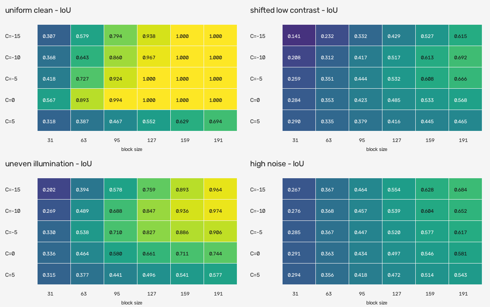
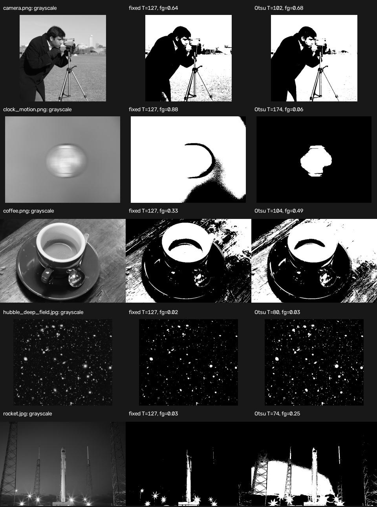
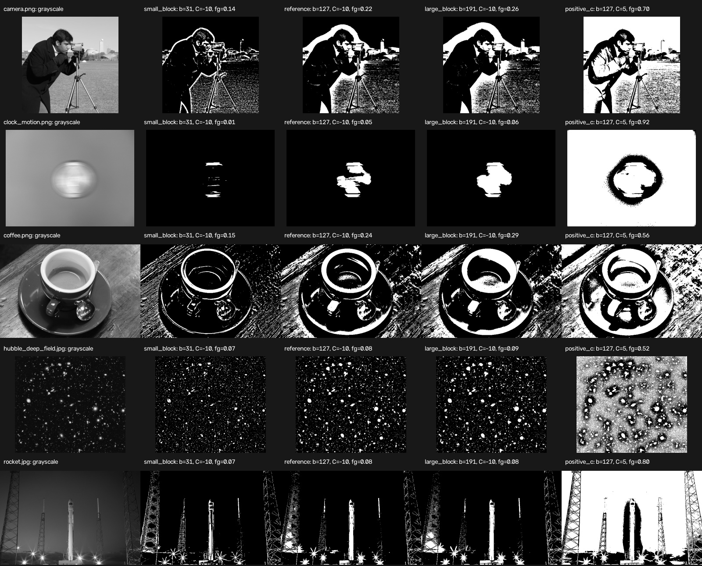
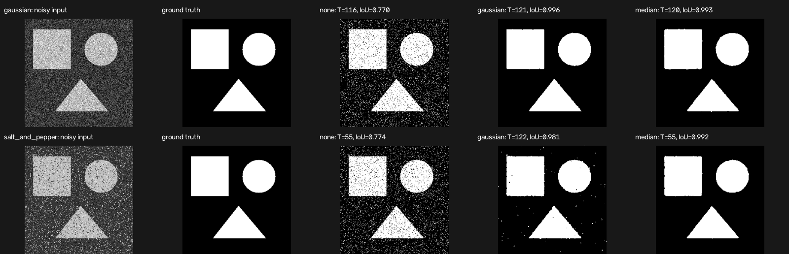
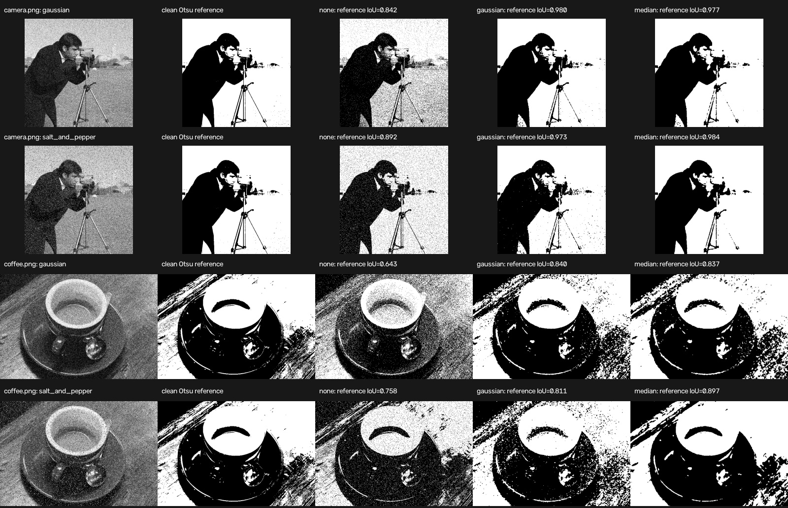
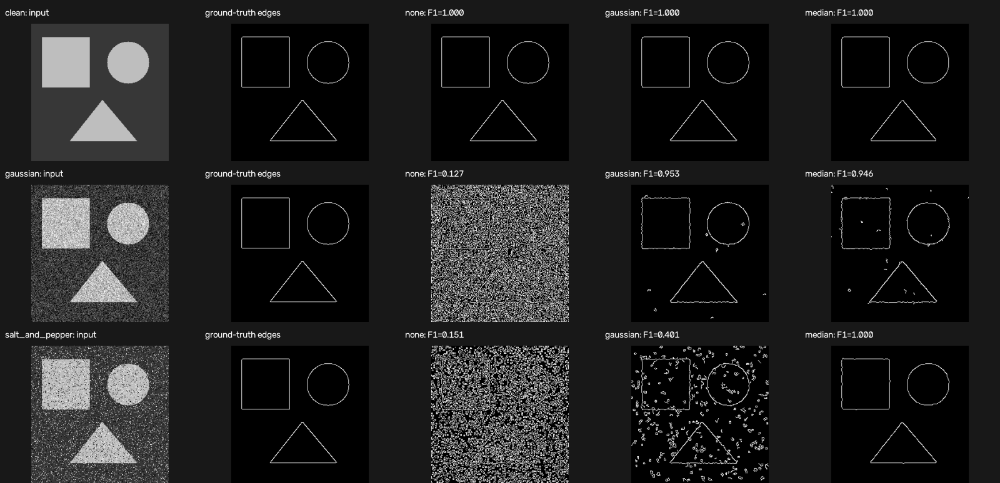
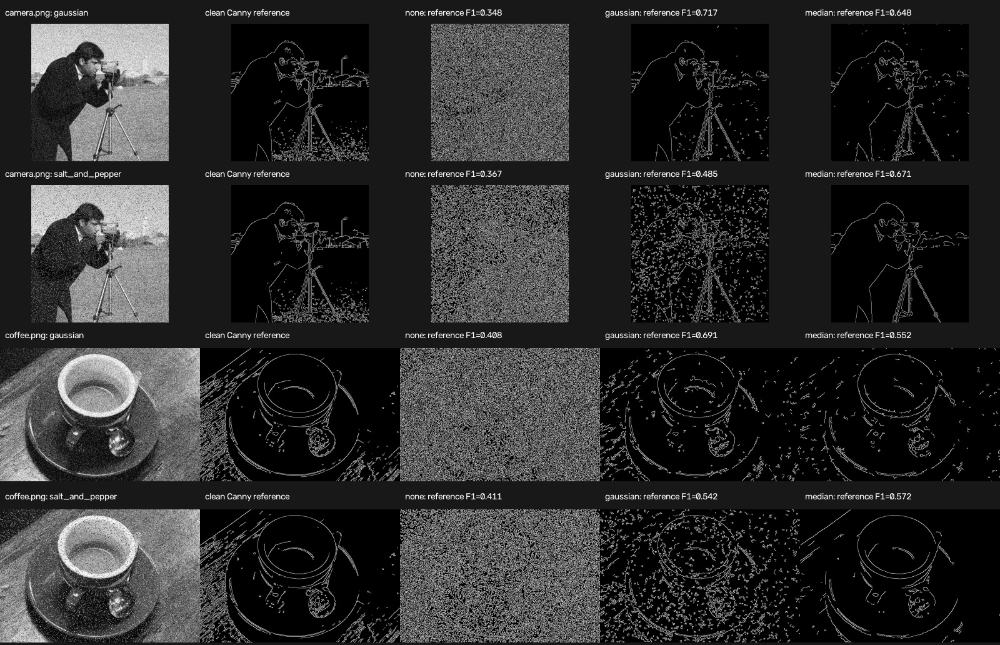
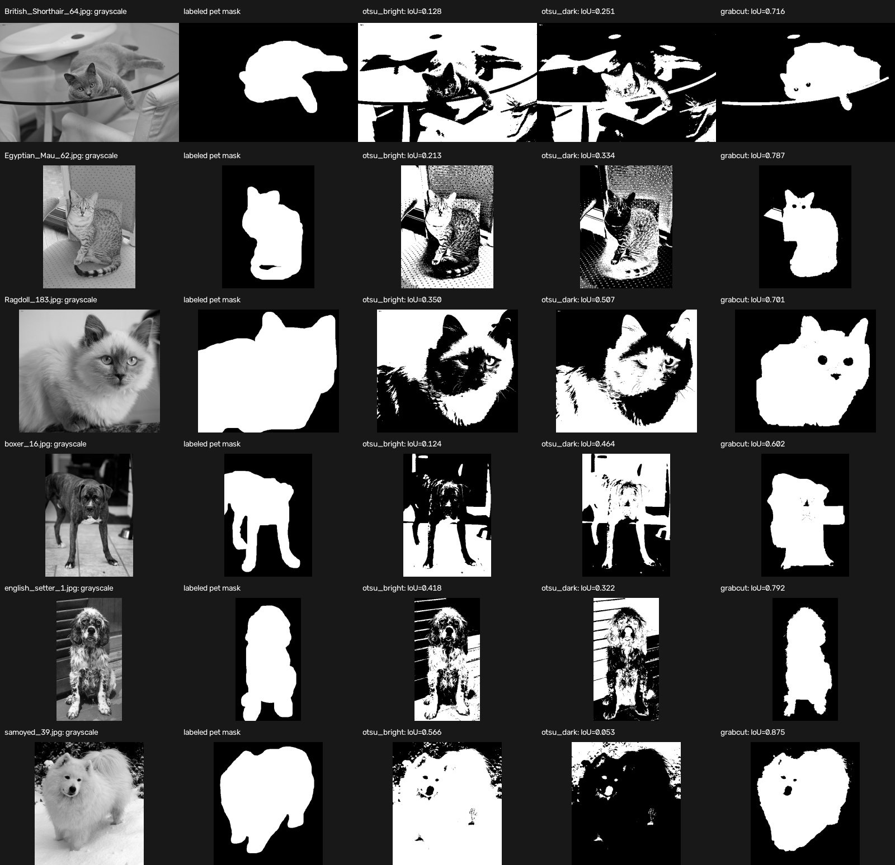

# Experiment Results

## 日本語概要

本書は、5種類の中核実験で実施した165件の手法・条件評価をまとめています。二値化、近傍条件の感度、ノイズ除去、輪郭検出、公開正解マスクによる画像分割について、数値表と比較画像を実験別に記録し、異なる指標を順位付けには使用しません。

結果、解釈、根拠ファイルの詳細は以下の英語本文を参照してください。

---

## English Summary

This document preserves the detailed reference results and experiment-specific interpretation. Use the [result interpretation guide](result-interpretation.md) for metric definitions and valid comparisons, and the [limitations](limitations.md) before extending any conclusion beyond the tested condition.

## Cross-Experiment Summary

The default suite contains 165 method-condition evaluations.

| Experiment | Evaluations | Metric | Reference value | Evidence scope |
| --- | ---: | --- | ---: | --- |
| `thresholding` | 12 | IoU | 0.847 | Adaptive method under uneven illumination |
| `adaptive-sensitivity` | 120 | Mean IoU | 0.830 | Best tested shared configuration |
| `denoising` | 6 | IoU | 0.992 | Median filter under salt-and-pepper noise |
| `edge-detection` | 9 | F1 | 1.000 | Median filter under salt-and-pepper noise |
| `labeled-dataset` | 18 | Mean IoU | 0.745 | GrabCut on the selected six-image subset |

These values answer different research questions and are not directly comparable. The [result index](../results/README.md) defines the summary schema and traces each value to its CSV and visual evidence.

## Thresholding

The reference run uses seed `7`, a fixed threshold of `127`, and one adaptive configuration shared across all scenarios.

| Scenario | Method | Parameters | IoU | F1 |
| --- | --- | --- | ---: | ---: |
| `uniform_clean` | Fixed | `T = 127` | 1.000 | 1.000 |
| `uniform_clean` | Otsu | `T = 45` | 1.000 | 1.000 |
| `uniform_clean` | Adaptive | `block = 127, C = -10` | 0.967 | 0.983 |
| `shifted_low_contrast` | Fixed | `T = 127` | 0.333 | 0.499 |
| `shifted_low_contrast` | Otsu | `T = 153` | 0.914 | 0.955 |
| `shifted_low_contrast` | Adaptive | `block = 127, C = -10` | 0.517 | 0.682 |
| `uneven_illumination` | Fixed | `T = 127` | 0.453 | 0.623 |
| `uneven_illumination` | Otsu | `T = 110` | 0.453 | 0.623 |
| `uneven_illumination` | Adaptive | `block = 127, C = -10` | 0.847 | 0.917 |
| `high_noise` | Fixed | `T = 127` | 0.953 | 0.976 |
| `high_noise` | Otsu | `T = 118` | 0.945 | 0.972 |
| `high_noise` | Adaptive | `block = 127, C = -10` | 0.539 | 0.701 |


Otsu's method adapts when the low-contrast distribution shifts above the fixed threshold. Under uneven illumination, both global methods remain near `0.453` IoU, while the adaptive method reaches `0.847` by using spatially varying thresholds.

The adaptive method is not uniformly better. It introduces small false-negative regions in the clean case, performs below Otsu's method in the low-contrast case, and amplifies local noise in the high-noise case. This result supports method selection based on failure conditions rather than treating any automatic method as a default improvement.

Reproduce the artifacts with:

```bash
python experiments/run_thresholding_comparison.py --output results
```

Use `--adaptive-block-size` and `--adaptive-c` to run an alternative shared adaptive configuration. The block size must be an odd integer of at least `3`. The complete metrics are in [`results/thresholding_metrics.csv`](../results/thresholding_metrics.csv).

## Adaptive Parameter Sensitivity

The parameter grid produces 120 evaluations and an IoU heatmap.

| Scenario | Best tested block size | Best tested C | IoU | F1 |
| --- | ---: | ---: | ---: | ---: |
| `uniform_clean` | 127 | -5 | 1.000 | 1.000 |
| `shifted_low_contrast` | 191 | -10 | 0.692 | 0.818 |
| `uneven_illumination` | 191 | -10 | 0.974 | 0.987 |
| `high_noise` | 191 | -15 | 0.684 | 0.812 |



Larger neighborhoods improve the tested uneven-illumination condition because they capture background variation across a wider spatial scale. They also improve the low-contrast and high-noise cases within this grid, but the best `C` differs by condition.

The highest mean IoU across all four scenarios is `0.830` at `block = 191, C = -10`. This aggregate does not make the configuration optimal for every scenario.

Reproduce the artifacts with:

```bash
python experiments/run_adaptive_sensitivity.py --output results
```

The complete [`adaptive_sensitivity_metrics.csv`](../results/adaptive_sensitivity_metrics.csv) preserves every evaluated configuration.

## Public Thresholding Samples

Five CC0 or public-domain photographs from the scikit-image sample data provide qualitative checks for the global and adaptive methods.

```bash
python experiments/run_public_image_sample.py
python experiments/run_adaptive_public_sample.py
```



The global-method sample reports the selected threshold and foreground fraction without claiming segmentation accuracy. See the [public thresholding report](../results/public_sample/README.md) for detailed interpretation, provenance, and licenses.



At `C = -10`, increasing the block size from `31` to `191` increases the foreground fraction in all five samples. Changing `C` from `-10` to `5` at block size `127` produces a larger shift, including `4.57%` to `91.60%` on the smooth clock image. These are behavioral diagnostics, not accuracy results. See the [adaptive public sample report](../results/adaptive_public_sample/README.md).

## Denoising Before Thresholding

The controlled denoising experiment uses the same known geometric ground truth for two noise models.

| Noise | Denoising | Otsu threshold | IoU | F1 |
| --- | --- | ---: | ---: | ---: |
| Gaussian | None | 116 | 0.770 | 0.870 |
| Gaussian | Gaussian 5 × 5 | 121 | 0.996 | 0.998 |
| Gaussian | Median 5 × 5 | 120 | 0.993 | 0.996 |
| Salt and pepper | None | 55 | 0.774 | 0.873 |
| Salt and pepper | Gaussian 5 × 5 | 122 | 0.981 | 0.990 |
| Salt and pepper | Median 5 × 5 | 55 | 0.992 | 0.996 |



Both filters reduce pixel-level thresholding errors in these conditions. Gaussian filtering is best for the Gaussian-noise scenario, while median filtering is best for salt-and-pepper noise. The experiment isolates preprocessing choice by keeping the kernel size, clean intensity levels, ground truth, and downstream thresholding method fixed.

Reproduce the artifacts with:

```bash
python experiments/run_denoising_comparison.py --output results
```

The complete [`denoising_metrics.csv`](../results/denoising_metrics.csv) includes precision and recall.

### Public denoising sample

```bash
python experiments/run_denoising_public_sample.py
```



Each denoised output is compared with the clean-image Otsu mask. This reference-mask IoU measures threshold stability, not semantic segmentation accuracy. See the [public denoising report](../results/denoising_public_sample/README.md).

## Edge Detection Under Controlled Noise

The Canny experiment evaluates clean, Gaussian-noise, and salt-and-pepper conditions.

| Condition | Denoising | Edge pixels | Precision | Recall | F1 |
| --- | --- | ---: | ---: | ---: | ---: |
| Clean | None | 987 | 1.000 | 1.000 | 1.000 |
| Gaussian noise | None | 23,565 | 0.068 | 1.000 | 0.127 |
| Gaussian noise | Gaussian 5 × 5 | 1,171 | 0.910 | 1.000 | 0.953 |
| Gaussian noise | Median 5 × 5 | 1,224 | 0.897 | 1.000 | 0.946 |
| Salt and pepper | None | 19,492 | 0.081 | 1.000 | 0.151 |
| Salt and pepper | Gaussian 5 × 5 | 4,659 | 0.251 | 1.000 | 0.401 |
| Salt and pepper | Median 5 × 5 | 985 | 1.000 | 1.000 | 1.000 |



The unfiltered noisy images preserve the true boundary neighborhoods but create many false edges, producing high recall and very low precision. Gaussian filtering recovers the Gaussian-noise condition, while median filtering removes the isolated salt-and-pepper responses in this synthetic case.

Reproduce the artifacts with:

```bash
python experiments/run_edge_detection_comparison.py --output results
```

The [`edge_detection_metrics.csv`](../results/edge_detection_metrics.csv) includes all nine evaluations, thresholds, tolerance, edge counts, precision, recall, and F1.

### Public edge sample

```bash
python experiments/run_edge_public_sample.py
```



The public sample compares each noisy output with the clean-image Canny edge map. It measures algorithmic stability rather than agreement with human-labeled boundaries. See the [public edge report](../results/edge_public_sample/README.md).

## Labeled Public Dataset Evaluation

A six-image Oxford-IIIT Pet subset provides pixel-level trimaps for a compact quantitative comparison.

| Method | Mean IoU | Mean F1 |
| --- | ---: | ---: |
| Brighter-foreground Otsu | 0.300 | 0.438 |
| Darker-foreground Otsu | 0.322 | 0.466 |
| Fixed-inset GrabCut | 0.745 | 0.851 |



The two Otsu polarities vary sharply by image because the pet is not consistently brighter or darker than its background. GrabCut performs better on all six selected images by combining color distributions with the assumption that the image boundary contains background.

The small, fixed subset is useful for a reviewable experiment, but it is not a representative benchmark of the full dataset.

Reproduce the artifacts with:

```bash
python experiments/run_labeled_dataset_evaluation.py
```

See the [labeled evaluation report](../results/labeled_public_dataset/README.md) for per-image interpretation, reproduction details, data provenance, and limitations.

## Inspected Public-Image Workflow

An optional workflow connects [Image Dataset Inspector](https://github.com/cab0a/image-dataset-inspector) to the public-image experiment:

`Input Inspection → Thresholding Prototype → Qualitative Evaluation → Interpretation`

```bash
python -m pip install ".[workflow]"
python experiments/run_inspected_public_sample.py
```

The input audit records unreadable files and descriptive image metrics before thresholding. Only valid images continue to the experiment. A combined CSV joins inspection metrics with fixed and Otsu outputs for traceable analysis.


See the [workflow report](../results/inspected_public_sample/README.md) for the combined table, limitations, reproduction details, and data provenance.
