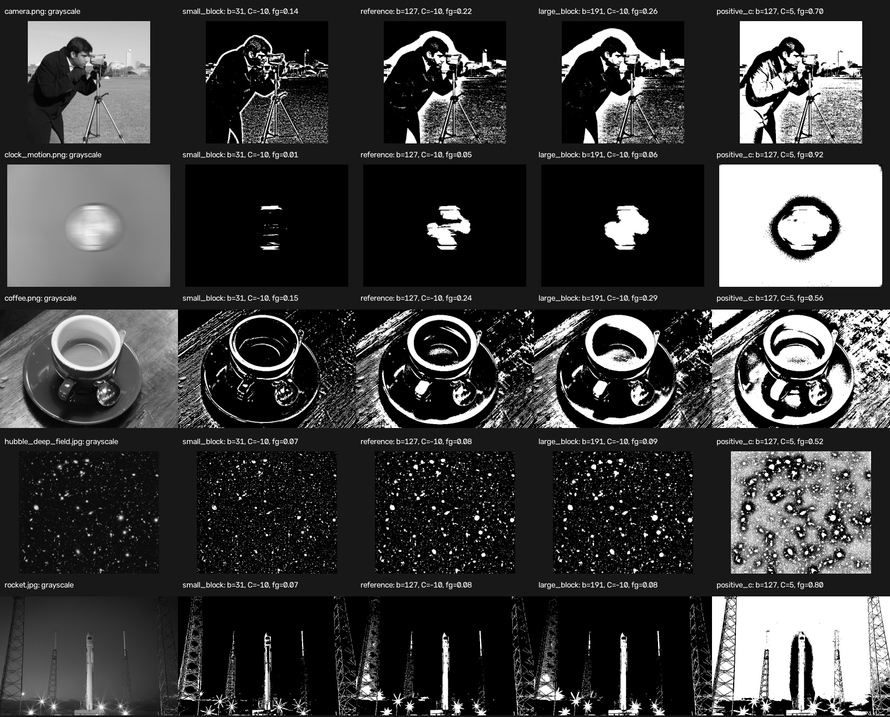

# Adaptive Public Image Sample

This qualitative sample applies four Gaussian adaptive-threshold configurations to five CC0 or public-domain photographs distributed with scikit-image. Downloads are pinned to scikit-image `v0.26.0` and verified with SHA-256.

The configurations use a one-factor-at-a-time comparison:

- `small_block`: `block = 31, C = -10`
- `reference`: `block = 127, C = -10`
- `large_block`: `block = 191, C = -10`
- `positive_c`: `block = 127, C = 5`

The first three isolate neighborhood size while keeping `C` fixed. The `reference` and `positive_c` configurations isolate the effect of changing `C` at one block size.

## Reproduction

```bash
python experiments/run_adaptive_public_sample.py
```

Expected summary:

```text
Images: 5
Configurations: 4
Evaluations: 20
Summary: results/adaptive_public_sample/adaptive_parameter_summary.csv
Comparison: results/adaptive_public_sample/adaptive_parameter_comparison.jpg
```

## Results

The table reports the fraction of white pixels in each output mask.

| Image | Small block | Reference | Large block | Positive C |
| --- | ---: | ---: | ---: | ---: |
| `camera.png` | 13.80% | 22.16% | 26.38% | 70.27% |
| `clock_motion.png` | 0.73% | 4.57% | 5.89% | 91.60% |
| `coffee.png` | 14.97% | 23.60% | 28.68% | 55.87% |
| `hubble_deep_field.jpg` | 6.64% | 8.20% | 8.50% | 51.68% |
| `rocket.jpg` | 7.05% | 8.01% | 8.33% | 79.55% |



## Interpretation

At `C = -10`, increasing the block size increases the selected foreground fraction for every sample. The change is strongest in the camera and coffee scenes, where the larger neighborhood incorporates broader illumination and structure. It is smaller in the dark Hubble and rocket scenes, where the three negative-`C` configurations retain similar bright details.

Changing `C` from `-10` to `5` at block size `127` has a much larger effect than changing the tested block size. OpenCV subtracts `C` from the local Gaussian-weighted statistic, so the positive value lowers the per-pixel threshold and selects substantially more foreground. On the smooth clock image, the foreground fraction rises from 4.57% to 91.60%.

These outputs are intensity partitions, not semantic object masks. The photographs have no task-specific ground truth, so foreground fraction describes behavior but cannot identify which configuration is accurate. The synthetic sensitivity experiment supplies quantitative evidence under controlled conditions; practical parameter selection would require representative labeled data and a task-relevant metric.

## Sources and Licenses

The image sources, author attributions, licenses, pinned URLs, and checksum policy are documented in the [public image sample](../public_sample/README.md#sources-and-licenses). The downloaded source images are cached locally and excluded from the repository; only derived comparison artifacts are committed.
